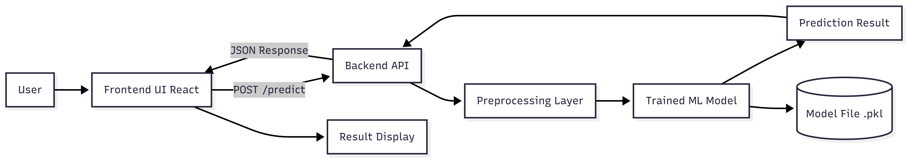

<div align="center">


# CerviCare

### AI-Powered Cervical Cancer Risk Assessment

[](https://fastapi.tiangolo.com)
[](https://react.dev)
[](https://python.org)
[](https://scikit-learn.org)
[](https://xgboost.readthedocs.io)
[](https://vitejs.dev)
[](https://tailwindcss.com)
[](LICENSE)

*For educational purposes only · Not a substitute for medical advice*

</div>

---

## Overview

**CerviCare** is a full-stack clinical decision-support tool that predicts cervical cancer risk from patient demographics, lifestyle factors, and STD/diagnostic history. It combines a production-grade machine learning pipeline with a polished React frontend and a FastAPI backend.

The ML pipeline trains and evaluates **12 model families** — including classical models, tree-based ensembles (XGBoost, LightGBM), a neural network, soft-voting, and stacking classifiers — on the [UCI Cervical Cancer Risk Factors dataset](https://archive.ics.uci.edu/dataset/383/cervical+cancer+risk+factors) (858 samples × 36 features). The deployed model is a **soft-voting ensemble** of Random Forest, XGBoost, and LightGBM.

---

## Features

- **Multi-step patient intake form** with real-time validation across 4 stages: Demographics, Lifestyle, STD History, and Diagnostics
- **Probability gauge + risk level** classification (Low / Moderate / Critical) with tailored clinical recommendations
- **Calibrated decision threshold** at 0.25 (tuned for high-recall screening; default 0.5 is suboptimal on class-imbalanced data)
- **Batch prediction endpoint** (`POST /predict/batch`) for processing multiple patients in a single request
- **SHAP interpretability** baked into the ML pipeline for feature-level explanations
- **SMOTE oversampling** applied exclusively within cross-validation folds to prevent data leakage
- **Stratified K-Fold CV** with `ImbPipeline` for honest performance estimates across the 14:1 class imbalance

---

## Architecture


## Folder Structure

```
cervicare/
├── backend/
│   └── app/
│       ├── main.py          # FastAPI app, endpoints, CORS, startup lifecycle
│       ├── model.py         # joblib artifact loading (model + scaler)
│       ├── predictor.py     # Inference logic with threshold and risk bucketing
│       ├── schemas.py       # Pydantic request model (33 features, validated)
│       ├── config.py        # MODEL_DIR, THRESHOLD (0.25), MODEL_VERSION
│       └── logger.py        # Structured logging
├── frontend/
│   └── src/
│       ├── App.jsx          # Root layout, header, hero, footer
│       └── components/
│           ├── PredictionForm.jsx  # 4-step form with state management
│           ├── FormField.jsx       # Numeric input + toggle switch primitives
│           ├── FormStepper.jsx     # Animated step indicator
│           └── ResultCard.jsx      # Risk gauge, stats, recommendations
└── CerviCare_ML_Pipeline.pdf       # Full pipeline documentation
```

---

## ML Pipeline

The training pipeline (`risk_factors_cervical_cancer.csv`) follows these stages in order:

| Stage | Detail |
|---|---|
| **Preprocessing** | Replace `"?"` sentinel → `NaN`; drop columns with >40% missing; median imputation |
| **Target** | `Biopsy` (binary) — the definitive clinical gold standard |
| **Split** | Stratified 80/20 (`random_state=42`); class ratio preserved in both folds |
| **Scaling** | `StandardScaler` — fit on train only, transform applied to test |
| **Imbalance** | `SMOTE` (k=5) on training set only → balanced 50/50 (686 + 686) |
| **Models** | 12 configurations across 5 families (see table below) |
| **CV** | 5-fold `StratifiedKFold` with SMOTE inside `ImbPipeline` |
| **Tuning** | `RandomizedSearchCV` (30 iterations) for XGBoost |
| **Threshold** | F1-optimal and recall-≥0.90 thresholds computed from PR curve |
| **Interpretability** | SHAP `TreeExplainer` — bar + beeswarm plots |
| **Persistence** | `joblib` — all 13 models + scaler saved to Google Drive |

### Model Families

| Family | Models |
|---|---|
| Classical | Logistic Regression, SVM (RBF), KNN, Gaussian Naive Bayes |
| Tree-Based | Decision Tree, Random Forest, Gradient Boosting, XGBoost, LightGBM |
| Neural | MLP (128 → 64 → 32, ReLU) |
| Ensemble | Soft Voting (RF + XGB + LGBM), Stacking (RF + XGB + LGBM + LR → LR meta) |
| Tuned | XGBoost (RandomizedSearchCV, 30 iter) |

Primary metric: **ROC-AUC**. Secondary: Recall and PR-AUC (preferred over accuracy on imbalanced data — a "predict never" baseline achieves 93.6% accuracy with 0% recall).

---

## API Reference

The backend runs on **FastAPI** with automatic OpenAPI docs at `/docs`.

### `GET /`
Returns service status, model version, and active threshold.

### `GET /health`
```json
{ "model_loaded": true, "scaler_loaded": true }
```

### `POST /predict`
Accepts a JSON body with 33 patient features. Returns:

```json
{
  "probability": 0.3142,
  "prediction": "HIGH RISK",
  "risk_level": "moderate",
  "threshold": 0.25,
  "model_version": "v1.0-voting-ensemble"
}
```

**Risk levels:** `low` (< 0.25) · `moderate` (0.25–0.60) · `critical` (≥ 0.60)

### `POST /predict/batch`
Accepts a JSON array of patient objects. Returns an array of prediction results.

---

## Getting Started

### Prerequisites

- Python 3.10
- Node.js 18+
- Trained model artifacts: `voting_model.pkl`, `scaler.pkl` (see ML pipeline docs)

### Backend

```bash
cd backend
python -m venv venv && source venv/bin/activate  # Windows: venv\Scripts\activate
pip install fastapi uvicorn scikit-learn xgboost lightgbm imbalanced-learn joblib

# Set model directory (defaults to ./models)
export MODEL_DIR=./models

uvicorn app.main:app --reload --port 8000
```

Place `voting_model.pkl` and `scaler.pkl` inside the `MODEL_DIR` folder before starting.

### Frontend

```bash
cd frontend
npm install

# Create .env.local
echo "VITE_API_URL=http://localhost:8000" > .env.local

npm run dev
```

Open [http://localhost:5173](http://localhost:5173).

---

## Configuration

| Variable | Location | Default | Description |
|---|---|---|---|
| `MODEL_DIR` | `backend/app/config.py` | `./models` | Directory containing `.pkl` artifacts |
| `THRESHOLD` | `backend/app/config.py` | `0.25` | Decision threshold for positive classification |
| `MODEL_VERSION` | `backend/app/config.py` | `v1.0-voting-ensemble` | Version string returned in API responses |
| `VITE_API_URL` | `frontend/.env.local` | — | Backend URL for the React app |

---

## Input Features

The model accepts **33 features** (the 2 columns with >91% missing values are dropped from the original 36). All inputs must be numeric; binary fields accept `0` or `1`.

| Index | Feature | Type |
|---|---|---|
| 0 | Age | Continuous |
| 1–3 | Sexual partners, First intercourse age, Pregnancies | Continuous |
| 4–6 | Smokes, Smokes years, Packs/year | Binary / Continuous |
| 7–10 | Hormonal contraceptives (binary + years), IUD (binary + years) | Binary / Continuous |
| 11–24 | STDs (binary + count + 12 subtypes) | Binary / Continuous |
| 25 | STDs: Number of diagnoses | Continuous |
| 26–29 | Dx:Cancer, Dx:CIN, Dx:HPV, Dx | Binary |
| 30–32 | Hinselmann, Schiller, Citology | Binary |

---

## Limitations & Future Work

- **Small dataset** — 858 samples limits neural network performance; MLP would benefit significantly from more data
- **Probability calibration** — Platt scaling or isotonic regression should be applied before clinical deployment
- **Prospective validation** — Model must be validated on an external held-out cohort before real-world use
- **Feature selection** — SHAP-based pruning could remove noisy STD sub-features and reduce overfitting
- **Multi-target learning** — Joint prediction of Hinselmann, Schiller, Citology, and Biopsy may improve overall accuracy
- **Hyperparameter optimization** — Replacing `RandomizedSearchCV` with Optuna (Bayesian optimization) would find better configurations with fewer trials

---

## Disclaimer

> **CerviCare is for educational and research purposes only.** It is not a certified medical device and must not be used for clinical diagnosis or treatment decisions. Always consult a qualified healthcare professional. Machine learning predictions are probabilistic — false negatives and false positives will occur.

---

## License

Distributed under the MIT License. See [`LICENSE`](LICENSE) for details.
