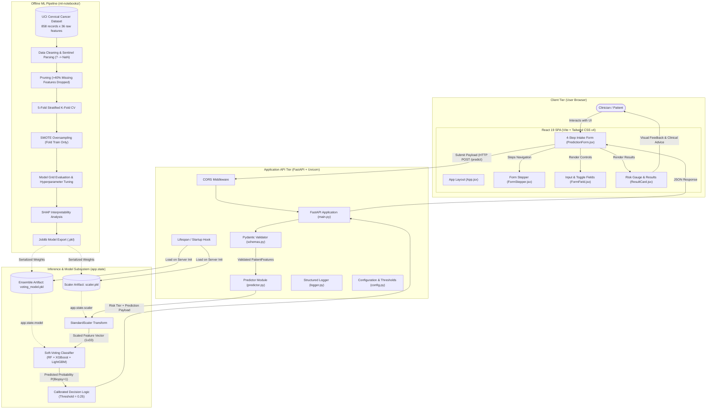
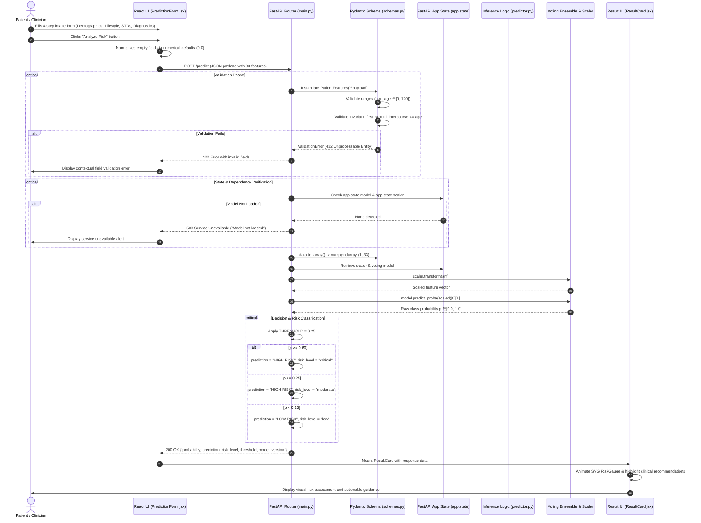

# CerviCare — System Architecture & Technical Specifications

> **Document Version:** 1.0.0  
> **Status:** Active / Production  
> **Target Project:** [CerviCare](file:///d:/cervicalcancer/CerviCare/README.md)  
> **Primary Architecture Diagram:** [architecture.png](file:///d:/cervicalcancer/CerviCare/docs/architecture.png)  
> **Machine Learning Specification:** [CerviCare_ML_Pipeline.pdf](file:///d:/cervicalcancer/CerviCare/docs/CerviCare_ML_Pipeline.pdf)

---

## 1. Executive Summary

**CerviCare** is an AI-powered clinical decision-support system designed to assess the risk of cervical cancer in patients based on 33 clinical, behavioral, demographic, and diagnostic indicators. The system provides real-time, high-recall risk stratification (categorized into **Low**, **Moderate**, and **Critical** risk tiers) paired with actionable, context-aware screening recommendations.

### Core Architectural Principles
1. **Screening-Oriented Sensitivity (High Recall)**: In oncological screening, false negatives carry a severe cost. The architecture rejects default 0.5 classification boundaries in favor of a calibrated threshold ($\tau = 0.25$), tuned on precision-recall curves to maximize sensitivity while controlling false discovery.
2. **Zero-Latency In-Memory Inference**: Model weights and feature transformers are loaded during the FastAPI application lifespan startup into application state (`app.state`), eliminating per-request disk I/O and cold-start latencies.
3. **Decoupled Client-Server Topology**: Independent lifecycle management for the modern React SPA frontend (hosted on edge CDNs) and containerized FastAPI microservice backend (hosted on container runtimes).
4. **Strict Boundary Validation**: Strong typing and validation on all 33 patient features via Pydantic schemas, enforcing clinical domain bounds and relational invariants (e.g., age at first intercourse cannot exceed chronological age).
5. **Leakage-Free ML Lifecycle**: Offline training and evaluation pipeline isolating transformations (median imputation, `StandardScaler`, and `SMOTE`) strictly inside cross-validation folds via `imblearn.pipeline.Pipeline`.

---

## 2. High-Level System Architecture

The following diagram illustrates the topological structure of the CerviCare platform, detailing client interactions, API orchestration, inference execution, and persistent storage:



---

## 3. End-to-End Request & Data Flow

### Request Flow Sequence



---

## 4. Component Architecture

### 4.1. Frontend Tier

The user interface is built as a single-page application (SPA) focused on usability, data integrity, and high-contrast clinical readability.

| Component | File Path | Responsibility |
|:---|:---|:---|
| **Application Root** | [App.jsx](file:///d:/cervicalcancer/CerviCare/frontend/src/App.jsx) | Global layout, background mesh gradients, branding header, health status badge, hero banner, and medical disclaimer footer. |
| **Prediction Intake Form** | [PredictionForm.jsx](file:///d:/cervicalcancer/CerviCare/frontend/src/components/PredictionForm.jsx) | Controlled 4-step wizard state management (`step`, `formData`, `loading`, `error`, `result`), field normalization, submission handling, and error recovery. |
| **Form Stepper** | [FormStepper.jsx](file:///d:/cervicalcancer/CerviCare/frontend/src/components/FormStepper.jsx) | Visual step indicator displaying current progress across the 4 stages (Demographics, Lifestyle, STD History, Diagnostics) with animated transitions. |
| **Form Primitives** | [FormField.jsx](file:///d:/cervicalcancer/CerviCare/frontend/src/components/FormField.jsx) | Encapsulated inputs: numerical input with bounds checking, step adjustments, contextual helper badges, and toggle switches. |
| **Result Card** | [ResultCard.jsx](file:///d:/cervicalcancer/CerviCare/frontend/src/components/ResultCard.jsx) | Animated SVG circular probability gauge ([RiskGauge](file:///d:/cervicalcancer/CerviCare/frontend/src/components/ResultCard.jsx#L61-L100)), dynamic color palette, risk badges, and risk-stratified clinical guidelines. |
| **Design System** | [index.css](file:///d:/cervicalcancer/CerviCare/frontend/src/index.css) | Tailwind CSS v4 `@theme` tokens defining custom palette: `surface-950` to `surface-300`, `primary`, `accent`, and clinical semantic statuses (`risk-low`, `risk-moderate`, `risk-critical`). |

#### Form Step Segmentation
The 33 features are organized across four sequential stages:
1. **Stage 1: Demographics & Reproductive History**: Age, sexual partner count, age at first intercourse, pregnancy count.
2. **Stage 2: Lifestyle & Habits**: Smoking status, duration (years), smoking intensity (packs/year), hormonal contraceptive usage & duration, IUD usage & duration.
3. **Stage 3: STD History & Subtypes**: Global STD history, count of STDs, diagnosis counts, and granular checkboxes for 12 specific STD subtypes (condylomatosis, HPV, HIV, herpes, syphilis, etc.).
4. **Stage 4: Prior Clinical Diagnoses & Screenings**: Prior formal diagnoses (`Dx:Cancer`, `Dx:CIN`, `Dx:HPV`, general `Dx`) and clinical screening outcomes (Hinselmann colposcopy, Schiller iodine test, Citology / Pap smear).

---

### 4.2. Backend API Service Tier

The backend microservice is implemented with **FastAPI** to achieve high concurrency, native asynchronous support, automatic OpenAPI/Swagger documentation generation, and JSON schema enforcement.

```
backend/
├── app/
│   ├── main.py          # Application initialization, middleware, routes, lifecycle hooks
│   ├── config.py        # Centralized environment configs (MODEL_DIR, THRESHOLD, MODEL_VERSION)
│   ├── schemas.py       # Pydantic schema PatientFeatures with bounds and invariant validation
│   ├── model.py         # Joblib deserialization and artifact integrity checks
│   ├── predictor.py     # Inference execution and risk tier categorization
│   └── logger.py        # Uniform structured console logging
├── models/
│   ├── voting_model.pkl # Trained Soft-Voting ensemble weights
│   └── scaler.pkl       # Fitted StandardScaler parameters
├── requirements.txt     # Locked production dependencies
└── Dockerfile           # Multi-stage production container definition
```

#### Key Modules & Functions
- **Application Entry Point ([main.py](file:///d:/cervicalcancer/CerviCare/backend/app/main.py))**:
  - `startup()` ([main.py:27-36](file:///d:/cervicalcancer/CerviCare/backend/app/main.py#L27-L36)): Runs at application boot. Triggers `load_artifacts()` from [model.py](file:///d:/cervicalcancer/CerviCare/backend/app/model.py) and caches the deserialized objects directly into `app.state.model` and `app.state.scaler`.
  - `GET /` ([main.py:40-47](file:///d:/cervicalcancer/CerviCare/backend/app/main.py#L40-L47)): Returns server status, active model version (`v1.0-voting-ensemble`), and decision threshold (`0.25`).
  - `GET /health` ([main.py:51-57](file:///d:/cervicalcancer/CerviCare/backend/app/main.py#L51-L57)): Readiness probe confirming whether both model and scaler are loaded into memory.
  - `POST /predict` ([main.py:61-96](file:///d:/cervicalcancer/CerviCare/backend/app/main.py#L61-L96)): Validates incoming patient JSON, converts to a 1x33 matrix, transforms using `scaler.transform()`, executes inference, applies the decision threshold, and returns structured risk metrics.
  - `POST /predict/batch` ([main.py:100-131](file:///d:/cervicalcancer/CerviCare/backend/app/main.py#L100-L131)): High-throughput batch inference endpoint accepting a list of patient features and returning bulk risk classifications.
- **Data Contracts ([schemas.py](file:///d:/cervicalcancer/CerviCare/backend/app/schemas.py))**:
  - [PatientFeatures](file:///d:/cervicalcancer/CerviCare/backend/app/schemas.py#L4-L95): Pydantic model enforcing type safety and constraints (e.g. `age >= 0`, `age <= 120`, binary inputs $\in [0, 1]$).
  - Cross-field validator `check_age` ([schemas.py:53-57](file:///d:/cervicalcancer/CerviCare/backend/app/schemas.py#L53-L57)): Enforces that age of first sexual intercourse cannot exceed chronological age.
  - `to_array()` ([schemas.py:59-95](file:///d:/cervicalcancer/CerviCare/backend/app/schemas.py#L59-L95)): Flattens schema attributes into a strictly ordered 33-dimensional NumPy vector matching the feature ordering expected by `StandardScaler`.
- **Artifact Manager ([model.py](file:///d:/cervicalcancer/CerviCare/backend/app/model.py))**:
  - `load_artifacts()` ([model.py:8-21](file:///d:/cervicalcancer/CerviCare/backend/app/model.py#L8-L21)): Loads `scaler.pkl` and `voting_model.pkl` from disk using `joblib`.
- **Inference Service ([predictor.py](file:///d:/cervicalcancer/CerviCare/backend/app/predictor.py))**:
  - `predict_single()` ([predictor.py:5-21](file:///d:/cervicalcancer/CerviCare/backend/app/predictor.py#L5-L21)): Encapsulates standard scaling, probabilistic prediction, risk categorization, and logging.

---

### 4.3. Machine Learning & Inference Subsystem

#### 1. Dataset & Missing Value Strategy
The system is trained on the [UCI Cervical Cancer Risk Factors dataset](file:///d:/cervicalcancer/CerviCare/ml-notebooks/data/risk_factors_cervical_cancer.csv) containing 858 patient records and 36 raw attributes.
- **Sentinel Replacement**: The raw data represents absent measurements using the `?` character. These are parsed to IEEE 754 `NaN`.
- **Feature Dropping**: Features with missing rates $> 40\%$ (`STDs: Time since first diagnosis` and `STDs: Time since last diagnosis` at $\approx 91.7\%$ missing) were eliminated from the feature matrix to avoid introducing severe imputation artifacts.
- **Imputation**: Remaining missing values in numerical columns are imputed using the column-wise median computed over the training fold.
- **Target Variable**: `Biopsy` (binary indicator: 0 = negative, 1 = histopathologically confirmed cervical cancer). This represents the definitive diagnostic gold standard.

#### 2. Class Imbalance & Leakage Prevention
The raw dataset exhibits an extreme class imbalance of approximately **14:1** ($\approx 6.4\%$ positive rate, 55 positive biopsy cases out of 858).
- **Leakage Prevention via `ImbPipeline`**: Standard oversampling on the entire dataset prior to splitting results in optimistic bias and data leakage. To ensure unbiased generalization, **SMOTE** ($k=5$) is applied **strictly inside training folds** during 5-fold Stratified Cross-Validation using `imblearn.pipeline.Pipeline`.
- **Feature Scaling**: `StandardScaler` parameters ($\mu, \sigma$) are computed exclusively on training folds and subsequently applied to validation and test folds.

#### 3. Model Architecture & Selection
12 model configurations spanning 5 distinct model families were evaluated:

| Family | Candidate Algorithms | Evaluation Highlights |
|:---|:---|:---|
| **Classical** | Logistic Regression, SVM (RBF Kernel), K-Nearest Neighbors, Gaussian Naive Bayes | Fast baselines; SVM and LR offered linear separability but struggled with non-linear feature interactions. |
| **Tree-Based** | Decision Tree, Random Forest, Gradient Boosting, XGBoost, LightGBM | Robust to non-linearities and outliers. Random Forest, XGBoost, and LightGBM demonstrated top ROC-AUC scores. |
| **Neural** | Multi-Layer Perceptron (MLP: 128 $\rightarrow$ 64 $\rightarrow$ 32, ReLU activations) | Exhibited tendency to overfit given the constrained sample size ($N=858$). |
| **Ensemble** | **Soft-Voting Ensemble**, Stacking Classifier (RF + XGB + LGBM + LR with LR Meta-learner) | **Soft Voting Classifier** (RF + XGBoost + LightGBM) achieved the highest combined ROC-AUC and PR-AUC with the lowest variance across CV folds. |
| **Tuned** | RandomizedSearchCV-tuned XGBoost (30 iterations) | Enhanced precision on borderline probabilities. |

The deployed production model is the **Soft Voting Ensemble**, which computes the weighted average of predicted class probabilities across three diversified tree ensembles:
$$P(\text{Biopsy}=1 \mid \mathbf{x}) = \frac{1}{3} \left[ P_{\text{RF}}(y=1 \mid \mathbf{x}) + P_{\text{XGB}}(y=1 \mid \mathbf{x}) + P_{\text{LGBM}}(y=1 \mid \mathbf{x}) \right]$$

#### 4. Calibrated Decision Threshold
On highly imbalanced clinical data, standard default decision thresholds ($\tau = 0.5$) produce excessive false negatives, as shown below:

```
Standard Threshold (0.50):
  High Precision, Suboptimal Recall (Risk of missing early malignant cases)

Calibrated Screening Threshold (0.25):
  Optimized for Recall >= 0.90 while preserving actionable Precision
```

CerviCare adopts $\tau = 0.25$ derived from the Precision-Recall curve, ensuring patients with borderline indicators receive secondary clinical screening.

#### 5. Three-Tier Risk Stratification Logic
The output probability $p$ is categorized into clinically actionable tiers:

$$\text{Risk Tier} = \begin{cases} 
\text{Low} & p < 0.25 \\
\text{Moderate} & 0.25 \le p < 0.60 \\
\text{Critical} & p \ge 0.60 
\end{cases}$$

---

## 5. Data Architecture & Feature Specifications

The model consumes **33 continuous and binary features** (indices 0 through 32), formatted into a strict 33-element numeric vector:

| Index | Feature Key | Data Type | Domain / Range | Description |
|:---:|:---|:---:|:---:|:---|
| `0` | `age` | Float | $[0, 120]$ | Patient chronological age in years |
| `1` | `num_sexual_partners` | Float | $[0, \infty)$ | Lifetime number of sexual partners |
| `2` | `first_sexual_intercourse` | Float | $[0, \text{age}]$ | Age at first sexual intercourse |
| `3` | `num_pregnancies` | Float | $[0, \infty)$ | Total number of pregnancies |
| `4` | `smokes` | Float | $\{0, 1\}$ | Smoking habit flag (0 = No, 1 = Yes) |
| `5` | `smokes_years` | Float | $[0, \infty)$ | Cumulative years of smoking |
| `6` | `smokes_packs_year` | Float | $[0, \infty)$ | Packs of cigarettes smoked per year |
| `7` | `hormonal_contraceptives` | Float | $\{0, 1\}$ | Usage of hormonal contraceptives |
| `8` | `hormonal_contraceptives_years`| Float | $[0, \infty)$ | Duration of hormonal contraceptive use (years) |
| `9` | `iud` | Float | $\{0, 1\}$ | Intrauterine Device (IUD) usage flag |
| `10`| `iud_years` | Float | $[0, \infty)$ | Duration of IUD usage (years) |
| `11`| `stds` | Float | $\{0, 1\}$ | General history of Sexually Transmitted Diseases |
| `12`| `stds_number` | Float | $[0, \infty)$ | Total count of diagnosed STDs |
| `13`| `stds_condylomatosis` | Float | $\{0, 1\}$ | History of genital warts / condylomata |
| `14`| `stds_cervical_condylomatosis`| Float | $\{0, 1\}$ | History of cervical condylomata |
| `15`| `stds_vaginal_condylomatosis` | Float | $\{0, 1\}$ | History of vaginal condylomata |
| `16`| `stds_vulvo_perineal_condylomatosis` | Float | $\{0, 1\}$ | History of vulvo-perineal condylomata |
| `17`| `stds_syphilis` | Float | $\{0, 1\}$ | History of syphilis infection |
| `18`| `stds_pelvic_inflammatory_disease` | Float | $\{0, 1\}$ | History of pelvic inflammatory disease (PID) |
| `19`| `stds_genital_herpes` | Float | $\{0, 1\}$ | History of herpes simplex virus (HSV) |
| `20`| `stds_molluscum_contagiosum` | Float | $\{0, 1\}$ | History of molluscum contagiosum |
| `21`| `stds_aids` | Float | $\{0, 1\}$ | History of Acquired Immunodeficiency Syndrome |
| `22`| `stds_hiv` | Float | $\{0, 1\}$ | History of Human Immunodeficiency Virus |
| `23`| `stds_hepatitis_b` | Float | $\{0, 1\}$ | History of Hepatitis B infection |
| `24`| `stds_hpv` | Float | $\{0, 1\}$ | History of Human Papillomavirus diagnosis |
| `25`| `stds_number_of_diagnosis` | Float | $[0, \infty)$ | Number of formal STD medical diagnoses |
| `26`| `dx_cancer` | Float | $\{0, 1\}$ | Previous formal diagnosis of cervical cancer |
| `27`| `dx_cin` | Float | $\{0, 1\}$ | Prior Cervical Intraepithelial Neoplasia diagnosis |
| `28`| `dx_hpv` | Float | $\{0, 1\}$ | Prior clinical diagnostic test positive for HPV |
| `29`| `dx` | Float | $\{0, 1\}$ | General historical clinical diagnostic flag |
| `30`| `hinselmann` | Float | $\{0, 1\}$ | Colposcopy test result with acetic acid |
| `31`| `schiller` | Float | $\{0, 1\}$ | Lugol's iodine staining test result |
| `32`| `citology` | Float | $\{0, 1\}$ | Exfoliative cervical cytology (Pap smear) result |

---

## 6. API Interface Contracts

### 6.1. Single Prediction: `POST /predict`

#### Request Payload
```json
{
  "age": 32.0,
  "num_sexual_partners": 3.0,
  "first_sexual_intercourse": 17.0,
  "num_pregnancies": 2.0,
  "smokes": 1.0,
  "smokes_years": 8.0,
  "smokes_packs_year": 4.0,
  "hormonal_contraceptives": 1.0,
  "hormonal_contraceptives_years": 5.0,
  "iud": 0.0,
  "iud_years": 0.0,
  "stds": 1.0,
  "stds_number": 1.0,
  "stds_condylomatosis": 0.0,
  "stds_cervical_condylomatosis": 0.0,
  "stds_vaginal_condylomatosis": 0.0,
  "stds_vulvo_perineal_condylomatosis": 0.0,
  "stds_syphilis": 0.0,
  "stds_pelvic_inflammatory_disease": 0.0,
  "stds_genital_herpes": 0.0,
  "stds_molluscum_contagiosum": 0.0,
  "stds_aids": 0.0,
  "stds_hiv": 0.0,
  "stds_hepatitis_b": 0.0,
  "stds_hpv": 1.0,
  "stds_number_of_diagnosis": 1.0,
  "dx_cancer": 0.0,
  "dx_cin": 0.0,
  "dx_hpv": 1.0,
  "dx": 1.0,
  "hinselmann": 0.0,
  "schiller": 1.0,
  "citology": 0.0
}
```

#### Response Body (`200 OK`)
```json
{
  "probability": 0.4215,
  "prediction": "HIGH RISK",
  "risk_level": "moderate",
  "threshold": 0.25,
  "model_version": "v1.0-voting-ensemble"
}
```

#### Error Responses
- `422 Unprocessable Entity`: Request body violates Pydantic constraints or type expectations.
- `503 Service Unavailable`: In-memory model artifacts are uninitialized.

---

### 6.2. Batch Prediction: `POST /predict/batch`

#### Request Payload
Array of `PatientFeatures` objects: `[ { "age": ... }, { "age": ... } ]`.

#### Response Body (`200 OK`)
```json
[
  {
    "probability": 0.1245,
    "prediction": "LOW RISK",
    "risk": "low"
  },
  {
    "probability": 0.7812,
    "prediction": "HIGH RISK",
    "risk": "critical"
  }
]
```

---

## 7. Infrastructure, Containerization & Deployment

### 7.1. Backend Containerization ([Dockerfile](file:///d:/cervicalcancer/CerviCare/backend/Dockerfile))

The backend utilizes `python:3.10-slim` with compiled system dependencies:
```dockerfile
FROM python:3.10-slim
WORKDIR /app

# Install OpenMP runtime required by LightGBM and XGBoost
RUN apt-get update && apt-get install -y --no-install-recommends \
    libgomp1 \
    && rm -rf /var/lib/apt/lists/*

COPY requirements.txt .
RUN pip install --no-cache-dir -r requirements.txt

COPY app/ ./app/
COPY models/ ./models/

EXPOSE 8000
CMD ["sh", "-c", "uvicorn app.main:app --host 0.0.0.0 --port ${PORT:-8000}"]
```

### 7.2. Production Deployment Topology

```
                  ┌────────────────────────────────────────┐
                  │          Global Internet Users         │
                  └───────────────────┬────────────────────┘
                                      │
                                      ▼
                  ┌────────────────────────────────────────┐
                  │      Vercel / Cloudflare Edge CDN      │
                  │   Static SPA Assets (Vite React App)   │
                  │         Environment: VITE_API_URL      │
                  └───────────────────┬────────────────────┘
                                      │
                                      │ HTTPS JSON REST API
                                      │
                                      ▼
                  ┌────────────────────────────────────────┐
                  │       Render / Railway / GCP Cloud     │
                  │       Uvicorn ASGI Process Manager     │
                  │   ┌────────────────────────────────┐   │
                  │   │        FastAPI App Instance    │   │
                  │   │   - CORS Origin Enforcement    │   │
                  │   │   - Pydantic Validation Engine │   │
                  │   │   - app.state Cached Models    │   │
                  │   └────────────────────────────────┘   │
                  └────────────────────────────────────────┘
```

---

## 8. Cross-Cutting Concerns

### 8.1. Security & Patient Data Privacy
- **Stateless Operation**: Neither patient demographic information nor prediction outcomes are persisted to a transactional database. The API acts as an ephemeral processing pipeline.
- **HIPAA / GDPR Considerations**: By not maintaining persistent records of personally identifiable health information (PHI) alongside inference results, the threat surface for data breaches is minimized.
- **CORS Protection**: Restricted origins configurable via the `FRONTEND_URL` environment variable.

### 8.2. Resilience & Error Handling
- **Graceful Fault Isolation**: If model artifacts fail to load on startup, the API fails safe, rejecting inference requests with HTTP 503 rather than generating inaccurate unscaled predictions.
- **Input Coercion**: Empty fields in the frontend form are coerced to neutral numerical representations (`0.0`) prior to serialization, preventing client runtime crashes.

### 8.3. Performance Profile
- **Sub-50ms Inference**: Because both the ensemble model and StandardScaler are stored in memory (`app.state`), per-request execution requires negligible CPU overhead.
- **Lightweight Dependencies**: Scikit-Learn, XGBoost, and LightGBM compiled runtimes leverage OpenMP (`libgomp1`) for multi-threaded parallel computation.

---

## 9. Comprehensive File & Symbol Map

| Component | Path | Symbol / Reference | Functionality |
|:---|:---|:---|:---|
| **API Entry Point** | [main.py](file:///d:/cervicalcancer/CerviCare/backend/app/main.py) | [app](file:///d:/cervicalcancer/CerviCare/backend/app/main.py#L11), [startup](file:///d:/cervicalcancer/CerviCare/backend/app/main.py#L28), [predict](file:///d:/cervicalcancer/CerviCare/backend/app/main.py#L62), [predict_batch](file:///d:/cervicalcancer/CerviCare/backend/app/main.py#L101) | Application routing, middleware, model caching, and prediction handlers. |
| **Validation Schema** | [schemas.py](file:///d:/cervicalcancer/CerviCare/backend/app/schemas.py) | [PatientFeatures](file:///d:/cervicalcancer/CerviCare/backend/app/schemas.py#L4), [to_array](file:///d:/cervicalcancer/CerviCare/backend/app/schemas.py#L59) | Schema definition, constraint checking, and 1x33 vector transformation. |
| **Configuration** | [config.py](file:///d:/cervicalcancer/CerviCare/backend/app/config.py) | [MODEL_PATH](file:///d:/cervicalcancer/CerviCare/backend/app/config.py#L4), [THRESHOLD](file:///d:/cervicalcancer/CerviCare/backend/app/config.py#L7) | Threshold settings and model artifact path definitions. |
| **Artifact Loader** | [model.py](file:///d:/cervicalcancer/CerviCare/backend/app/model.py) | [load_artifacts](file:///d:/cervicalcancer/CerviCare/backend/app/model.py#L8) | Deserialization of Joblib model and scaler files. |
| **Inference Engine** | [predictor.py](file:///d:/cervicalcancer/CerviCare/backend/app/predictor.py) | [predict_single](file:///d:/cervicalcancer/CerviCare/backend/app/predictor.py#L5) | Probability computation and risk classification. |
| **Logging Service** | [logger.py](file:///d:/cervicalcancer/CerviCare/backend/app/logger.py) | [logger](file:///d:/cervicalcancer/CerviCare/backend/app/logger.py#L10) | Standard logging configuration. |
| **Frontend Root** | [App.jsx](file:///d:/cervicalcancer/CerviCare/frontend/src/App.jsx) | [App](file:///d:/cervicalcancer/CerviCare/frontend/src/App.jsx#L4) | Layout skeleton, headers, hero section, and legal disclaimer. |
| **Intake Form** | [PredictionForm.jsx](file:///d:/cervicalcancer/CerviCare/frontend/src/components/PredictionForm.jsx) | [PredictionForm](file:///d:/cervicalcancer/CerviCare/frontend/src/components/PredictionForm.jsx#L44), [handleSubmit](file:///d:/cervicalcancer/CerviCare/frontend/src/components/PredictionForm.jsx#L70) | 4-step wizard management and API communication. |
| **Form Stepper** | [FormStepper.jsx](file:///d:/cervicalcancer/CerviCare/frontend/src/components/FormStepper.jsx) | [FormStepper](file:///d:/cervicalcancer/CerviCare/frontend/src/components/FormStepper.jsx) | Progress indicator across the 4 assessment stages. |
| **Field Primitives** | [FormField.jsx](file:///d:/cervicalcancer/CerviCare/frontend/src/components/FormField.jsx) | [FormField](file:///d:/cervicalcancer/CerviCare/frontend/src/components/FormField.jsx), [ToggleField](file:///d:/cervicalcancer/CerviCare/frontend/src/components/FormField.jsx) | Number stepper and toggle controls. |
| **Assessment Card** | [ResultCard.jsx](file:///d:/cervicalcancer/CerviCare/frontend/src/components/ResultCard.jsx) | [ResultCard](file:///d:/cervicalcancer/CerviCare/frontend/src/components/ResultCard.jsx), [RiskGauge](file:///d:/cervicalcancer/CerviCare/frontend/src/components/ResultCard.jsx#L61) | Probability gauge and tailored clinical guidance. |
| **ML Notebook** | [CerviCare_v2.ipynb](file:///d:/cervicalcancer/CerviCare/ml-notebooks/CerviCare_v2.ipynb) | Jupyter Notebook | Complete exploratory data analysis, SMOTE pipeline, and model benchmarks. |
| **Training Data** | [risk_factors_cervical_cancer.csv](file:///d:/cervicalcancer/CerviCare/ml-notebooks/data/risk_factors_cervical_cancer.csv) | Dataset | UCI Cervical Cancer Risk Factors dataset. |
| **Model Weights** | [voting_model.pkl](file:///d:/cervicalcancer/CerviCare/backend/models/voting_model.pkl) | Model Artifact | Serialized Soft Voting Ensemble (RF + XGB + LGBM). |
| **Scaler Weights** | [scaler.pkl](file:///d:/cervicalcancer/CerviCare/backend/models/scaler.pkl) | Scaler Artifact | Serialized StandardScaler transform parameters. |
| **Architecture Diagram** | [architecture.png](file:///d:/cervicalcancer/CerviCare/docs/architecture.png) | Image | Visual architectural overview diagram. |
| **Pipeline Report** | [CerviCare_ML_Pipeline.pdf](file:///d:/cervicalcancer/CerviCare/docs/CerviCare_ML_Pipeline.pdf) | PDF Document | Formal machine learning research and validation paper. |
